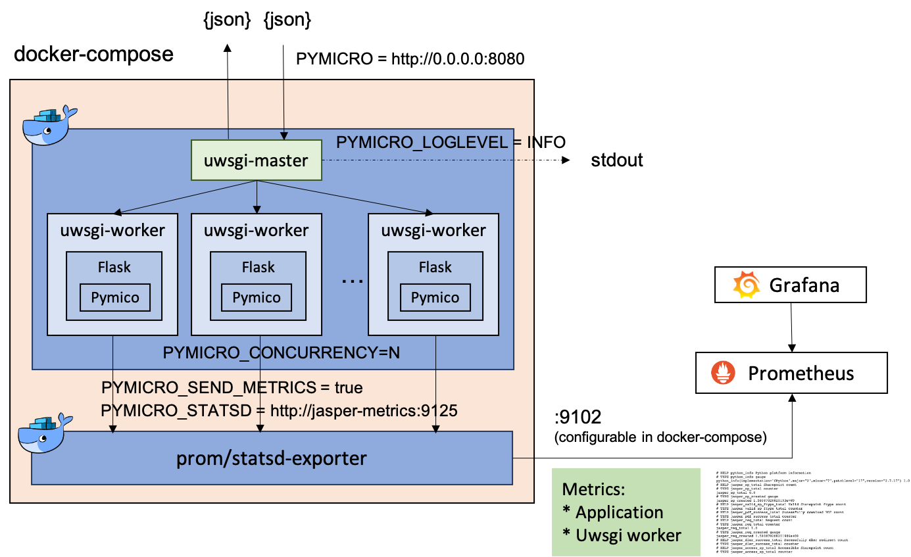

# Pymicro-flask

[](https://travis-ci.com/ShandiLin/pymicro-flask)

Pymicro-flask is a Python micro web service using uwsgi and flask, with prometheus metrics<br/><br/>
It accepts POST requests with json format data and return with json format result. The prometheus metrics are updated after handling requests and is accessible in `/metrics` <br/>



# APIs
* Service: `http://HOST:PORT/microservice`
* Prometheus:
    * If `$PYMICRO_SEND_METRICS`=`true`, metrics serve in `http://STATSD_HOST:STATSD_PORT/metrics`
        * default: `http://0.0.0.0:9102/metrics`
    * If `$PYMICRO_SEND_METRICS`=`false`, metrics serve in `http://HOST:PORT/metrics`
        * default: `http://0.0.0.0:8080/metrics`
> check [Prometheus Metrics](#Prometheus-Metrics)

## API Query Example
Messages handling logic in [`pymicro_flask/msg_handler.py`](pymicro_flask/msg_handler.py)

```bash
$ curl -X POST -d '{"hello":"pymicro-flask"}' http://HOST:PORT/microservice
{
    "pymicro.s_time":"1582092922.6149724",
    "pymicro.e_time":"1582092924.6151698",
    "pymicro.ret":0,
    "hello":"pymicro-flask"
}
```

## Start Service
```bash
$ cd pymicro-flask
$ docker-compose -f docker/docker-compose.yml up -d
```

## ENV Config
* check env setting in [`docker/docker-compose.yml`](docker/docker-compose.yml)
```ini
# Dirpath to temporarily store pdf files (default: /tmp)
PYMICRO_DATADIR=/tmp

# Server config (default: "http://0.0.0.0:8080")
PYMICRO=http://0.0.0.0:8080

# How many reuquests can be handled concurrently (default: 4)
PYMICRO_CONCURRENCY=4

# [Optional] Enable gevent loop engine in uwsgi if given (default disabled)
PYMICRO_GEVENT=2

# Timeout for pymicro service (default: 60s)
PYMICRO_TIMEOUT=60

# If sending metrics to statsd server (default: false)
PYMICRO_SEND_METRICS=true

# Statsd server config (default: http://0.0.0.0:9125)
# Used when PYMICRO_SEND_METRICS=true
PYMICRO_STATSD=http://pymicro-metrics:9125

# Log level for pymicro (default: INFO)
PYMICRO_LOGLEVEL=WARN

# Log config file for pymicro (default: "conf/logging_config.ini")
PYMICRO_LOGCONFIG=<path to your log config file>
```

# Prometheus Metrics
* If `$PYMICRO_SEND_METRICS` is `true`, all the uwsgi workers will send the metrics defined by application to statsd server using [`datadogpy`](https://github.com/DataDog/datadogpy). Prometheus can pull metrics from `http://STATSD_HOST:STATSD_PORT/metrics`.
    * Check [`docker/docker-compose.yml`](docker/docker-compose.yml) for the deployment setting.
    * Also [`uwsgi-dogstatsd`](https://github.com/Datadog/uwsgi-dogstatsd) plugin is used for sending information of every uwsgi worker.
* If `$PYMICRO_SEND_METRICS` is `false`, [`prometheus/client_python`](https://github.com/prometheus/client_python) is used to dispatch metrics to `/metrics` path. Prometheus can pull metrics from `http://HOST:PORT/metrics`.
    * Web Service and Metrics Service serve in same port, which should be only used for testing.
    * Metrics defined by application only.

Metric update logic: [`pymicro_flask/server/metrics.py`](pymicro_flask/server/metrics.py).<br/>

## metrics
* `pymicro_req_total` (counter) The total counts of requests
* `pymicro_ret_req_total{pymicro_ret="0"}` (counter) The total counts of different ret code requests

# Pymicro Service
## How to run in local
* requirements: `python>=2.7, >=3.6`
* if using `virtualenv` for python, make sure commands below is running within venv.
```shell
$ cd pymicro-flask
$ ./run_build.sh
$ pymicro_uwsgi
```

## Config
default configs are in `conf/`
* `conf/service.toml`
    * default config of pymicro service, such as server config, statsd server config, ...
* `conf/logging_config.ini`
    * default log config of pymicro service, can be override by `$PYMICRO_LOGCONFIG`
    * log level can be override by `$PYMICRO_LOGLEVEL`(default:`INFO`) without override log config file
* `conf/uwsgi.ini`
    * default uwsgi config, define such as master node, workers num, app callable, ...
    * `process` parameter which can control the number of uwsgi workers can be override by `$PYMICRO_CONCURRENCY`(default: `4`)


## Bin executable
Service executables are in [`bin/`](bin/). After running [`run_build.sh`](run_build.sh), executables would be copyed to system executable path. (defined by `scripts` parameter in [`setup.py`](setup.py))
```
$ which pymicro_server
/usr/local/bin/pymicro_server

$ which pymicro_uwsgi
/usr/local/bin/pymicro_uwsgi
```

### [`pymicro_uwsgi`](bin/pymicro_uwsgi)
> bash script

The script parses envs and config [`conf/uwsgi.ini`](conf/uwsgi.ini) which let uwsgi knows where flask callable is. Finally, invoke uwsgi command below to start uwsgi service.
```bash
uwsgi --ini $(which pymicro_server)/conf/uwsgi.ini
```
flask related config in  [`conf/uwsgi.ini`](conf/uwsgi.ini)
```ini
# let uwsgi call pymicro_server
file = @(exec://which pymicro_server)
# pymicro_uwsgi will set $PYMICRO_CALLABLE based on $PYMICRO_SEND_METRICS. DO NOT set it yourself
callable = $(PYMICRO_CALLABLE)
```

### [`pymicro_server`](bin/pymicro_server)
> python script

It's being invoked by [`pymicro_uwsgi`](bin/pymicro_uwsgi). However, it can be run directly to start flask service without uwsgi.<br/>
It's useful for testing application logic.

## Debug Log
Defined in [`conf/logging_config.ini`](conf/logging_config.ini). Only one handler to output pymicro logs to `stdout` in default logging config.
It you need to change logging setting (e.g., add handlers), you can either
1. Modify [`conf/logging_config.ini`](conf/logging_config.ini)
2. Replace the whole logging config file by setting `$PYMICRO_LOGCONFIG` to the path of your `logging_config.ini`

## Tests
`./run_tests.sh` will run the tests with coverage and term missing.
